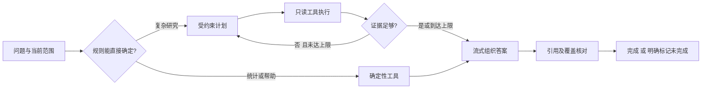

# AI 雷达专用研究 Agent 开发方案

状态：待用户审阅；本轮实现后台交互、通用模型配置与真实流式输出，**不把它们称为已完成 Agent**。
日期：2026-09-15。此文作为《实施方案续篇》的专项章节，沿用 AI 动态首页、独立统计页、
公众免注册、浏览器保存会话、管理员管理来源和模型的既定约束。

## 先解决什么

目前助手主要把取回的事件和证据交给模型归纳，遇到复杂问题仍依赖有限规则。
回答不够好不能只归因于“没有 Agent”：取回资料是否相关、事件是否重复、发布日期是否准确、
范围是否完整，都直接影响答案。增加循环调用而不修正这些问题只会重复总结错误材料。

专用 Agent 的目标是：理解公众读者的问题，在明确的库内范围中选择少量只读工具，
拿到足够依据后给出易读结论、图表或对比，并明确资料缺口。
统计数字由数据库计算，模型负责判断应查什么、解释结果和组织表达。

## 用户会得到什么

| 问题 | 默认产物 | 实现方式 |
| --- | --- | --- |
| 今天有什么值得关注的 AI 动态？ | 3–5 条简短要点，附来源和收录范围 | 时间筛选、去重、重要性规则，模型归纳 |
| 最近7天模型发布比前7天多吗？ | 两期数量、差值和趋势图 | 数据库精确聚合；基期为0时不编造增长百分比 |
| 解释这个事件，和之前版本相比有什么变化？ | 变化、影响、尚不确定三部分 | 事件附件、同实体历史版本检索和证据对照 |
| 本月哪类进展最多？ | 排行图与一句话说明 | 既有聚合查询；模型不填写图表数字 |
| 这个说法的原文依据在哪里？ | 可展开的来源摘录和版本定位 | 引用解析与冻结 Evidence |
| 你好／你能做什么？ | 简短能力说明和示例问题 | 本地规则回复，无需调用模型 |

不是每个问题都必须展示完整模板。简单事实直接回答；需要比较时再用表格。
不因模型返回内容流畅就隐藏“资料不足”“范围仅覆盖部分”“报道时间与事件时间不同”等边界。

## 一条问题的执行流程

1. 固定本轮 ScopeSnapshot：时区、起止日期（包含端点）、类别、实体、附件、数据版本。
   页面后来切换范围不改写历史轮次。扩大检索范围必须展示可理解的范围变更建议。
2. 优先处理直接统计与导航意图。复杂问题才调用计划模型，返回受 JSON Schema 约束的计划。
3. 服务器验证工具名、参数和范围，再执行；模型不得生成 SQL、代码或任意网络请求。
4. 工具结果不足时最多进行有限补查。到达上限即回答已知部分及缺口，不无限循环。
5. 输出正文使用真实流式；中途文本标记“生成中，引用待核对”，完成后再发布正式引用。
6. 记录本轮调用、工具执行、失败、耗时和提供商实际 usage；取消关闭上游，但不承诺已产生费用退回。

## 工具边界

| 工具 | 入参 | 输出与约束 |
| --- | --- | --- |
| resolve_entities | 名称、可选类别 | 稳定实体 ID 与候选；重名必须澄清 |
| search_events | ScopeSnapshot、关键词、游标 | 事件 ID、相关摘要、精确总数、取回范围 |
| get_event_evidence | 已纳入范围的事件 ID | 冻结来源、版本、段落和摘录 |
| aggregate_events | 范围、日期/类别维度 | 精确数量及数据版本，复用统计仓储 |
| compare_periods | 等长度两期范围、同一组筛选 | 两期数值、差值、缺失日期、重叠提示 |
| build_chart | 已执行聚合结果 ID、允许的图表类型 | 服务端图表描述；数据仍来自原聚合结果 |

所有工具只读，不开放管理员设置、密钥、采集任务、写库、系统命令。
第一版默认不联网搜索；库外搜索以后作为独立能力，用户可见地说明范围与新来源状态。
只信任服务器的工具结果来源，不遵循网页、证据、对话历史中要求改写规则或泄露信息的指令。

## 图表与答案

- 图表仅使用目前易理解的分类排行、每日数量和日期×分类热力图。
- 模型可以选择维度、粒度和图表类型；字段需在白名单内，数值由服务端查询得到。
- 点击图表仍回到对应事件范围，不另造一份不一致的事件清单。
- 回答默认先给一句结论，再列必要依据；原始工具日志和详细检索计划保持折叠。
- 引用需要核对 ID、版本、段落和逐字摘录。后续人工/模型语义核验另设状态，
  避免把“引用真实存在”误称为“每条结论已独立证实”。
- 跨来源去重和日期质量没达到验收前，统计注明“已收录事件”，不宣称行业全量趋势。

## 模型、用量和运行控制

优先复用已配置的 Flash，不预先购买或切换模型。管理员可以更换兼容服务，
但是否支持 JSON、工具调用和流式必须通过能力检查，不能只看地址能连接。
本轮的供应商预设只是可编辑模板，不能代表所有账户都有模型权限。

第一版建议上限：每轮1次计划、最多2轮工具执行/合计4次工具调用、1次答案生成；
规则统计跳过计划调用。取消不自动重试。后续只有评测证据表明收益明显才放宽。
模型输出上限沿用后台设置；提取、问答、测试分别按用途记账。
不换算用户费用，不用输出长度推算未知 tokens；提供商未返回 usage 就明确未知。

会话仍保存在浏览器；只发送当前请求必要的历史、附件和范围。
服务端只存脱敏执行元数据与必要的查询快照，不默认永久保存全部对话原文。
用户清理浏览器会丢失本地会话，导出功能继续保留。

## 分步实现与验收门槛

以下是计划目标，不是当前已通过的指标。

### A：建立质量基线和范围快照
- 整理至少40个冻结问题：事件解释、实体歧义、时间比较、统计、来源核对、无资料、异常取消。
- 先标注预期事件/日期/引用，记录现有助手表现，再判断 Agent 是否提升。
- 修复报道日期冒充发生日期的样本；同一发布的多报道归并后再比较数量。

### B：确定性工具与服务端计划
- 复用仓储而非让模型写 SQL；建立类型化 ToolCall/ToolResult/ScopeSnapshot。
- 日期边界、时区、实体重名、附件冲突、总数与分页、零基期同比等全部通过自动测试。
- 同样条件下，图表和事件列表的数量100%一致；权限越界测试不得执行管理工具。

### C：有限 Agent 编排
- 建立显式状态机：理解→工具→补查/回答→校验→完成/失败/取消。
- 先支持事件解释、两期比较和资料核对；能力未支持的问题给出明确替代操作。
- 冻结问题任务完成率目标≥90%；无依据问题应拒绝编造。
- 引用定位有效率100%；结论与引文的语义一致性人工抽查目标≥95%，失败案例留在回归集。

### D：图表与交互
- 完成服务器聚合结果到图表的绑定、范围联动、流式状态与取消。
- 首段输出在上游结束之前出现；不能把完整回答拆字来假装流式。
- 断流保留可读草稿并标未完成，不发布未经核对的引用；历史不能把失败稿恢复为完成。

### E：运行与公开访问
- 限流、全局并发、无自动付费重试、脱敏审计、幂等和提供商故障降级。
- 最终按问题集比较基线与新 Agent 的质量、首段延迟、调用次数、token和失败率。
- 若质量未超过基线，保留简单问答路径；不只用“多了 Agent”作为上线理由。

## 与当前方案的关系

本轮先交付后台批量探测、简明错误、通用模型配置、可见测试对话和真实 SSE。
下一步先做 A/B 与数据日期、去重工作，再实现 C/D。此文供你查看后调整优先级；
本轮不会把专用 Agent 编排悄悄标成已经上线。

## 参考与借鉴

- [CC-switch 添加供应商](https://github.com/farion1231/cc-switch/blob/main/docs/user-manual/zh/2-providers/2.1-add.md)：
  借鉴预设填表与自定义入口，不复制其 CLI 配置编辑结构。
- [CC-switch 编辑供应商](https://github.com/farion1231/cc-switch/blob/main/docs/user-manual/zh/2-providers/2.3-edit.md)：
  借鉴保存后测试的操作顺序。本站密钥仍只保存在服务器，不回显到浏览器。
- [DeepSeek 官方接口](https://api-docs.deepseek.com/zh-cn/)、
  [OpenAI GPT-4.1 mini](https://developers.openai.com/api/docs/models/gpt-4.1-mini)、
  [阿里云兼容接口](https://help.aliyun.com/zh/model-studio/model-calling-in-sub-workspace)、
  [Kimi 官方接口](https://platform.kimi.com/docs/api/chat)：用于本轮预设的URL与兼容性核对。
