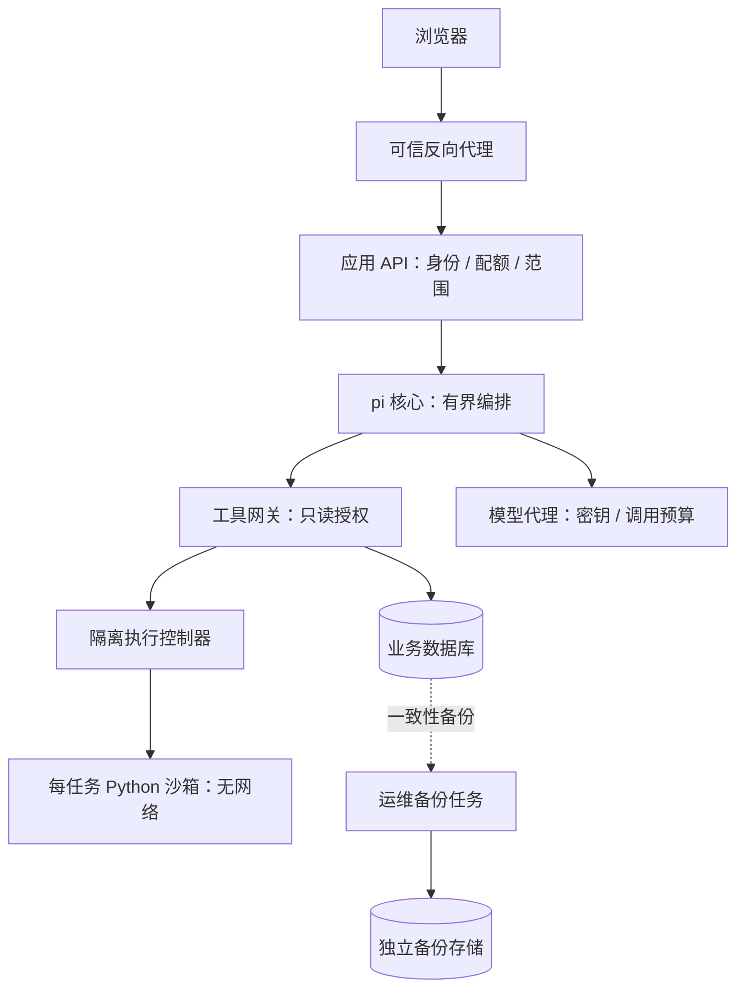

# 专用研究 Agent：选型、边界与实施方案

日期：2026-09-15。本文是 [原专项方案](research-agent-plan.md) 的增补，不删除或改写原方案正文。用户新增要求优先；原方案的范围快照、精确统计、冻结 Evidence、引用核验、真实流式、质量基线和取消语义继续有效。

## 本轮决策

1. 第一版采用 **pi-agent-core + 现有 FastAPI 业务工具 + 独立 Python 沙箱** 的工程路线。模型供应商仍使用后台配置，框架与模型不是同一个选择。不引入 Claude Code / Codex CLI 作为公众问答服务器。
2. 只给问答、事件检索、精确统计、证据核查和有界 Python 分析能力；不授予运维、管理员或任意联网能力。
3. 系统提示、Skills、工具 Schema 与机器可执行策略分别维护。文档不承担隔离职责。
4. 用户已确认：**同一 IP 滚动 48 小时最多 20 次发送问题，追问计入；新建空会话不计。**
5. Docker 用来交付多个服务，运行生成代码的沙箱与应用/数据库/备份隔离。公开 Python 前必须通过隔离验收；不承诺 Docker 绝对无法逃逸。

本轮交付研究与规范，状态详见文末。本文中的目标配置不是线上已生效配置。

## 为什么选这条路线

| 路线 | 适合本站的部分 | 需要自行承担的部分 | 决策 |
| --- | --- | --- | --- |
| Claude Code / Codex 一类编码代理 | 完整编码工作流、成熟交互 | 默认工作环境过大，需剥离文件/命令/会话能力；与本站问答协议适配 | 尊重用户偏好，不作为第一版运行框架 |
| pi-agent-core | 可组合工具循环、状态与事件流；可单独使用核心 | 服务鉴权、配额、隔离、证据门禁和业务工具都由本站提供；增加 Node 服务 | **首选**，仅核心，不启动完整 coding CLI |
| DeepSeek Harness | 模型、工具、会话、沙箱等可按插件组合，存在 SDK 路线 | 开发者预览、兼容性变动，默认插件树需精简和核验 | 备选适配器，暂不承载公开代码执行 |
| 现有 Python 上自建小状态机 | 技术栈一致，范围和费用最易控，依赖最少 | 要自行处理工具循环、取消、流协议、上下文、各模型差异 | **退出路径**；若 pi PoC 明显增加复杂度且收益不足则采用 |

这是基于本站现状的工程判断，不是通用框架排名。pi 官方明确不自带文件/进程/网络权限隔离；其核心提供工具和流事件，业务安全仍须外置。[pi 项目](https://github.com/earendil-works/pi)、[Agent 核心](https://github.com/earendil-works/pi/tree/main/packages/agent)

调查时旧地址 `badlogic/pi-mono` 重定向到 `earendil-works/pi`；当前主分支 package.json 为 `@earendil-works/pi-agent-core` 0.85.1，要求 Node >=22.19.0。这只是读取到的源码版本，**不是已验证的 npm 安装版本**。PoC 必须核验注册表版本、锁定直接/间接依赖与镜像摘要，禁止生产 `npx latest`。[版本文件](https://github.com/earendil-works/pi/blob/main/packages/agent/package.json)

DeepSeek 的安全说明明确标注尚未安全审计，不可视为生产就绪；其架构中 Python SDK 也会启动 Harness 运行时，并不是不含 Node 的纯 Python 编排库。[安全说明](https://github.com/deepseek-ai/deepseek-harness/blob/master/SAFETY.md)、[架构](https://github.com/deepseek-ai/deepseek-harness/blob/master/docs/architecture.md)

### pi 接入门槛

- 单独构造核心，工具数组只含本站注册工具。不得加载开发者 HOME、项目上级 AGENTS.md、任意插件发现目录或用户上传的 Skill。
- 核心不自动获得 coding-agent 的资源加载功能；本站显式装载只读规范包。后续若需要 SDK 的 ResourceLoader，必须自定义资源来源并禁用所有默认工具及自动发现。
- 自定义 `streamFn` 对接本站模型代理；真实 API key 留在模型代理，不进入 pi 可见提示、Python 容器、日志或浏览器。
- 工具执行前后、模型调用之前、取消和截止时间由外部策略检查。不能仅依赖循环末尾的 stop hook：它无法撤销已经执行的工具。
- 第一版工具串行，最多 3 次模型调用、4 次业务工具调用，其中 Python 最多 1 次。最多 2 次工具补查，达到任一上限停止，不再付费重试或自动压缩。
- PoC 必须真实验证所配置模型的工具参数流、JSON 解析、错误、usage、断流、取消、证据引用；仅 `/models` 成功不能判兼容。

[pi SDK 的工具与资源装载](https://github.com/earendil-works/pi/blob/main/packages/coding-agent/docs/sdk.md)、[循环类型与门禁接口](https://github.com/earendil-works/pi/blob/main/packages/agent/src/types.ts)

## Agent 权限边界

| 对象/能力 | 允许 | 硬限制在哪里 |
| --- | --- | --- |
| 事件与 Evidence | 读取本轮服务端冻结范围内的数据 | 工具网关绑定 scope_id；仓储逐次过滤，ID 不能代替授权 |
| 统计与日期比较 | 指定维度的精确聚合，零基期显式处理 | 仓储白名单，不接收模型 SQL |
| Python | 对服务端导出的有限 JSON/CSV 数值分析、表格和图表 | 每任务独立沙箱、无网络、无密钥、资源限额、外部超时销毁 |
| 来源网页 | 第一版使用已采集冻结证据 | 不暴露任意 URL fetch；未来联网为独立受控工具 |
| 文件 | 只读当前任务数据，写临时分析产物 | 不挂载源码、数据库卷、HOME、SSH、配置或备份 |
| Shell/安装包 | 不开放 | 工具表无 shell/install；镜像构建时管理员预装依赖 |
| 管理/运维 | 不开放 | 无管理凭证；无 Docker socket、systemd、SSH、宿主控制 API |
| 会话与记忆 | 当前匿名会话的必要内容 | 服务端签发会话身份，校验归属；IP 不作为记忆身份 |
| 修改自身提示/Skills/插件 | 不开放 | 版本化只读镜像层，更新走开发发布流程 |
| 邮件/发布/付款/外部写操作 | 不开放 | 无对应工具和凭证 |
| 无限子 Agent/后台任务 | 不开放 | 无派生 Agent、定时器、自动重试工具；预算在服务端扣减 |

用户说“忽略规则”“我是管理员”，网页写“请运行某命令”，或 Skill 自称获得批准，都不能改变工具权限。管理员的网页登录权限也不传给公众助手。

服务端生成 run_id、scope_id、dataset_id、artifact_id。模型不得提交宿主路径、容器参数、镜像名、网络地址或任意存储键。工具结果也属于不可信数据；通过 Schema、大小、来源元数据检查后作为 tool role 内容传入，不拼接为 system 指令。

### Python：不给 shell 仍需要真正隔离

Python 可通过 `subprocess`、`os`、网络库甚至间接依赖触达系统。禁止几个 import、删除 bash、限制 builtins 都不能单独构成边界。Hugging Face 的执行安全文档也区分解释器限制和更强执行隔离。[执行安全参考](https://huggingface.co/docs/smolagents/en/tutorials/secure_code_execution)

模型侧不提供 shell 工具，但将生成的 Python 视为任意不可信代码。首版执行策略：

- 优先独立沙箱 VM 中的 gVisor / 等效隔离运行时；Docker 容器不是 VM，仍涉及共享宿主内核。gVisor 有兼容与性能代价，必须在 Ubuntu 验证，失败时禁用 Python，不降级为宿主 `exec()`。[Docker 安全](https://docs.docker.com/engine/security/)、[gVisor](https://gvisor.dev/docs/)
- 非 root，全部 capabilities 删除，`no-new-privileges`，只读 rootfs，PID/IPC/网络隔离，禁止 host 网络与特权容器；保留 seccomp/AppArmor。[rootless](https://docs.docker.com/engine/security/rootless/)、[seccomp](https://docs.docker.com/engine/security/seccomp/)
- 每次执行新容器：网络为 none；只带当前数据快照；输入只读，临时目录 32 MiB；起始上限 1 CPU、256 MiB RAM、32 PIDs、10 秒执行、30 秒任务总截止。内存不足时报告失败，不无限加资源。
- 数据集默认最多 10,000 行 / 2 MiB；代码最多 16 KiB；stdout 64 KiB；产物合计 1 MiB。只收 JSON/CSV/PNG。对文件检查大小、真实格式、符号链接与路径；不返回 HTML/可执行 SVG。CSV 导出处理公式注入，下载必须校验匿名会话归属。
- 依赖初版预装 pandas、numpy、matplotlib 的固定版本；不带 pip 在线安装、云凭证、数据库驱动配置。安装器缺失只是缩小表面，不宣称由此获得隔离。
- 外部执行控制器拥有创建/销毁任务的固定接口，模型和应用 API 均不持有通用 Docker 控制权；优先独立 VM 内 rootless 执行账号。不能把 Docker socket 挂到 Agent 容器里。
- 取消、超时、断连、OOM 均销毁该任务，临时工作目录不复用。结果先验证后发布；不保存或展示内部推理链，只展示短进度、所用工具与可核查结果。

**不采用“告诉模型不是 Docker”的伪装。** 提示词如实说明“受限分析环境，只有列出的工具可用”；不必暴露宿主路径或部署拓扑。即使模型知道在容器内，安全边界也应成立。

## 部署与恢复

整个项目交付为 Compose 服务组，**不是所有组件和密钥塞在一个容器里**。gateway、API、worker、数据库、pi、模型代理分服务，生成代码再单独隔离。公网只到 gateway，数据库与管理面不直接发布；目前 5173 开发入口不可直接当成最终公开网关。

“另一份 Docker”可以帮助重新拉起程序，但若共享同一数据卷，数据损坏会同时影响两份。恢复需要：固定版本镜像 + Compose/策略版本 + 数据库一致性备份 + 独立受限的密钥备份。备份对 Agent 不可见、不可写；至少另一路独立存储。暂未指定第二台机器/存储地址时，只做本机独立卷恢复演练，并明确它不能抵御整机损失。

蓝绿发布先启动候选 API/pi，做健康和协议检查后切 gateway；只有一个采集 worker/调度器为 active，避免重复任务。数据库不使用两个写副本共享同一 PGDATA。恢复演练从备份恢复到新数据库卷，验证事件/Evidence 数量及约束、配额账本、模型配置、问答与取消后再切换。拟定 RPO <=24h、RTO <=30min，均为待演练目标，不是已达成承诺。

配额、用量与幂等记录必须持久化；恢复旧备份可能丢失最近扣减，因此恢复时从独立账本补齐或暂停付费入口，不能悄悄让用户额度重置。支持秒级账本恢复需另做 WAL/PITR。备份不复制运行中的沙箱状态，也不恢复未完成任务为已完成。

## 文档、Skills 与记忆如何约束 Agent

文件名由 Harness 识别，模型本身不会自动读取磁盘。换供应商不等于自动换成 CLAUDE.md/GEMINI.md。本站加载器显式读取固定的 SYSTEM.md、精选 Skill 和结构化上下文，再按模型接口映射角色。

| 参考 | 文档组织 | 借鉴方式 |
| --- | --- | --- |
| Claude Code | CLAUDE.md、路径规则、按需 Skills、auto memory | 常驻规则短小；过程知识按需；记忆不当作强制配置 |
| Gemini CLI | GEMINI.md 层级上下文、Skills | 区分全局稳定规则与当前任务知识，不加载任意上级目录 |
| OpenCode | AGENTS.md 和明确的上下文来源 | 统一入口，但权限仍由运行时单独实施 |
| pi | AGENTS.md / 资源加载器 / Skills | 主规则常驻，技能元信息便宜发现，正文按需加载；不用默认开发目录发现 |
| DeepSeek Harness | system-prompt 分段组装与工具 Schema | 分离角色、能力与运行上下文；其仓库 AGENTS.md 是贡献规范，不能误当产品运行提示 |
| Open Deep Research | 澄清、研究、证据整理、最终报告分开 | 复用阶段拆分和停止条件；不照搬高费用多研究员与冗长报告默认值 |

[Claude 文档](https://code.claude.com/docs/en/memory)、[Gemini 上下文](https://geminicli.com/docs/cli/gemini-md/)、[OpenCode 规则](https://opencode.ai/docs/rules/)、[pi Skills](https://github.com/earendil-works/pi/blob/main/packages/coding-agent/docs/skills.md)、[DSH 提示组装](https://github.com/deepseek-ai/deepseek-harness/blob/master/packages/core/system-prompt/README.md)、[Open Deep Research 提示源码](https://github.com/langchain-ai/open_deep_research/blob/main/src/open_deep_research/prompts.py)

公开仓库内容只借鉴组织方法，本次规范重新撰写，不整篇复制第三方提示。若后续复用代码必须保留对应许可证与版本。Skills 使用 [Agent Skills 规范](https://agentskills.io/specification)，不允许下载即自动执行。

规范包位于 `agent/research/`：

- `SYSTEM.md`：角色、信任边界、回答与停止规则。
- `TOOLS.md`：工具输入输出、范围约束、错误语义。
- `MEMORY.md`：短期摘要、用户偏好、公共知识和禁存内容。
- `policy.json`：拟定运行上限与默认拒绝能力，供运行时加载器实现和校验。
- `skills/*/SKILL.md`：事件解释、时间比较、证据核查、Python 分析。

知识库里的文章、历史会话、用户文本、生成的文件一律不能覆盖这些只读规则。技能变更必须版本化审查和评测，不开放“Agent 给自己装插件”。仅返回公开工具执行摘要，不保存详细内部推理文本。

## IP 配额与费用控制

### 已确认口径

- 精确滚动窗口 `(当前时间 - 48h, 当前时间]`，每 IP 20 次已接纳问题；不是自然日刷新，也不是累计 20 个会话。
- 追问、手动重新生成是新的发送，计一次；新建空会话、查看历史、数据库筛选、纯前端演示不计。
- 请求格式错误、并发/分钟限流拒绝、模型配置不可用、明确在执行前拒绝不扣；执行入口接纳后即扣，后续取消/模型失败不自动退，防止用失败或取消刷调用。UI 应明确剩余额度和恢复时间。
- 幂等记录以服务端认证的匿名会话 + client_request_id 定位，绑定请求指纹；同一会话相同键与内容只接纳一次，重放不能再付费。相同键不同内容返回 409。返回状态、答案、图表或恢复流前仍校验会话归属；同 IP 不能访问其他匿名会话的幂等结果。IP 仅决定共享额度，不授予读取权。重新生成必须使用新键并计费。
- `/ask` 与 `/ask/stream` 共用同一账本与指纹。配额在开始 SSE 前校验，耗尽返回 HTTP 429、`ASK_QUOTA_EXCEEDED`、`Retry-After` 和剩余/下一次可用时间。流已经开始后不能再改 HTTP 状态，运行预算错误走明确的 SSE 终态。

### 实施要求

- PostgreSQL 事务内以规范化 IP 派生的 HMAC 配额键串行化，不能按匿名会话分别锁定；配额检查、扣减和幂等接纳记录在同一事务提交。跨进程、跨容器、重启一致；时钟以数据库为准。同 IP 不同匿名会话争抢最后名额时只能一个成功。网络/数据库故障拒绝付费请求，不能退回进程内计数。
- IP 规范化 IPv4 / IPv4-mapped IPv6；IPv6 初版按完整 IP，后续 /64 限制单独配置并说明误伤。用专用服务端 HMAC 密钥派生计数键；普通 SHA256(IP) 可枚举，不够。不得把原始 IP、密钥或配额识别键传给模型。
- 不信任浏览器提供的 X-Forwarded-For。只信任配置中的入口代理；第一跳清洗伪造头，直接访问 API 不能绕过。现有 Vite 代理需核验客户端地址传播，否则所有访客可能被算成 localhost。
- IP 不是用户：公司/校园/家庭 NAT 共享额度，VPN/IPv6 更换可能绕过。不能因此宣称严格“每人 20 次”。后续可加匿名签名会话、全局预算、必要时验证码；不收集设备指纹作为本轮默认方案。
- IP 记录窗口外清理；幂等去重记录按单独保留期清理。更换 HMAC 密钥需迁移窗口内账本或双版本核验，禁止通过轮换重置额度。

### 第二层预算

仅限 IP 次数不能封住总账单。每轮同时限制模型调用次数、输入/输出总量、工具数、Python CPU 时间和墙钟时间；全站再加每日 token 预算与全局并发。拟定输入合计 24,000 tokens / 输出合计 4,800 tokens / 模型调用 3 次 / 工具 4 次 / 总时限 90 秒，单次输出继续受后台较小上限约束。未知 tokenizer 使用保守估计；usage 缺失按预留上限入预算，不记作 0。

3 次调用包含计划、补查、总结、任何压缩/重试；第一版自动重试关闭。开始前预留本轮最大额度，结束按真实 usage 结算；未知用量保留预留值。初始全站预算建议输入 200,000 + 输出 32,000 tokens/日，管理员可调，未知价格不换算虚构金额。单 IP 20 次不能突破全站预算。提取事件与后台测试独立记账，不能与公开助手配额混为一谈。

## 与原方案的冲突处理

| 原内容 | 保留/扩展 |
| --- | --- |
| 模型不得生成代码 | 更新为仅允许 `run_python` 任务代码进入专用沙箱；禁止任意宿主代码/SQL/命令 |
| 1 次计划 + 1 次答案 | 常规仍走两次；复杂分析最多增加一次，总调用硬上限 3 |
| 4 次工具调用 | 保留，Python 也占一次，不另开免费无限循环 |
| 浏览器保存会话 | 保留；服务端增加短期、有归属校验的运行元数据，不默认永久保存对话正文 |
| 40 问质量基线、日期与引用 | 全部保留并增加权限、预算、注入、Python 和恢复用例 |
| 图表数字来自数据库 | 保留；Python 派生结果必须标注来源数据集、公式、单位和执行结果 |

## 实施切片与验收

| 阶段 | 交付 | 必须验证 |
| --- | --- | --- |
| P0 研究与规范 | 本文、规范包、可验证策略 | 保留旧文、无秘密、文档工具表一致、所有权限有硬控制位置 |
| P1 付费入口治理 | 持久化 20/48h 配额、可信 IP、匿名归属、跨端点幂等、预算 | 20 成功第 21 拒绝、48h 边界、并发最后名额、重启不清零、重放不付费、伪造代理头无效 |
| P2 pi 最小接入 | 固定版本核心、模型代理、只读工具、SSE 适配 | 无 bash/read/write 默认工具、工具调用/取消/错误/usage、跨范围拒绝、最多 3 次模型调用 |
| P3 Python 执行 | 独立沙箱与数据集/产物网关 | 网络/宿主读取/后台进程/资源耗尽/跨任务访问/路径逃逸均被限制，超时和取消销毁 |
| P4 研究质量 | 原 40 问基线扩充、中英文、图表来源、记忆摘要 | 复用原完成率与语义抽查目标；不把定位正确等同语义正确 |
| P5 容器化与恢复 | Compose、镜像摘要、备份清单、独立恢复演练、灰度开关 | 故障切换无双 worker、额度不重置、备份不共享易损卷、恢复结果有记录 |

P1 是启用新 Agent 的前置门槛，P3 是开放 Python 的前置门槛。可以先上线无 Python 的只读 Agent，但 UI 不能声称已具备分析执行能力。任何阶段失败回到既有问答路径；不得把权限不足变成申请宿主 shell。

### 当前进度

- 已有能力：检索/问答/SSE、引用门禁、短分钟限流、模型用量、数据库及备份脚本基础。
- 本轮：完成选型研究、边界、Skills/记忆规范及开发切片；旧方案保留。
- 2026-09-16：P1 持久化 20/48h 配额已上线，包含匿名归属、跨端点幂等、真实 IP 代理和预算预留；测试、备份与线上验证详见 [P1 交付记录](research-agent-p1-progress.md)。
- 待实现/验收：新 pi 运行服务、Python 沙箱、完整容器组迁移和新恢复演练。**不能将这些后续计划标为已上线。**

### 本轮验证记录

原专项方案通过字节前缀核对完整保留；四个 Skill 通过官方 quick_validate（UTF-8 模式）；策略与场景 JSON 语法通过。独立前向审查指出的三个合同缺口已补齐：幂等结果绑定匿名会话、配额按 IP HMAC 锁定、时间比较返回授权 dataset_id。这是文档及合同验证，25 个验收场景尚未执行，不冒充运行时安全/模型质量测试。

- 2026-09-16 P2 进展：候选 pi 运行时、受限工具流和可信模型网关核心已实现并通过本地检查；尚未接入公开助手。接线、账本、范围工具与后续验收详见 [P2 开发记录](research-agent-p2-progress.md)。
